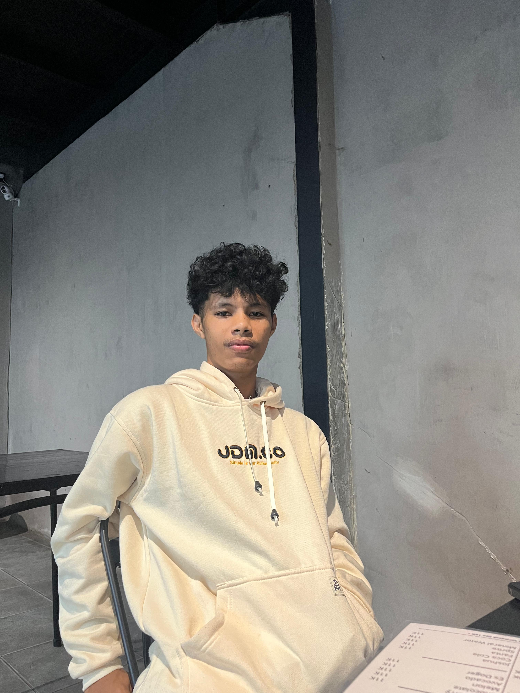

## Hi 👋 

<h1 align="center">👋 Hi, I'm Brian Putra Lende!</h1>
<h3 align="center">🚀 Web Developer | Tech Enthusiast</h3>

  
  
  
  
  

---

### 🛠️ About Me  
💻 I'm a **Web Developer** passionate about building web applications with **Laravel** and **CodeIgniter**.  
⚡ I enjoy solving **real-world problems** through coding and software development.  
📱 I also have expertise in **hardware troubleshooting** for laptops, smartphones, and computers.  

### 🔥 Tech Stack  
- **Languages**:    
- **Frameworks**:    
- **Frontend**:     
- **Database**:   
- **Version Control**:    

### 📊 GitHub Stats  

  

### 🌍 Connect With Me  
📧 **Email**: your.email@example.com  
🔗 **LinkedIn**: [linkedin.com/in/yourprofile](#)  
💻 **GitHub**: [github.com/your-username](#)  

---

⭐ **Feel free to explore my repositories and contribute!** 🚀
